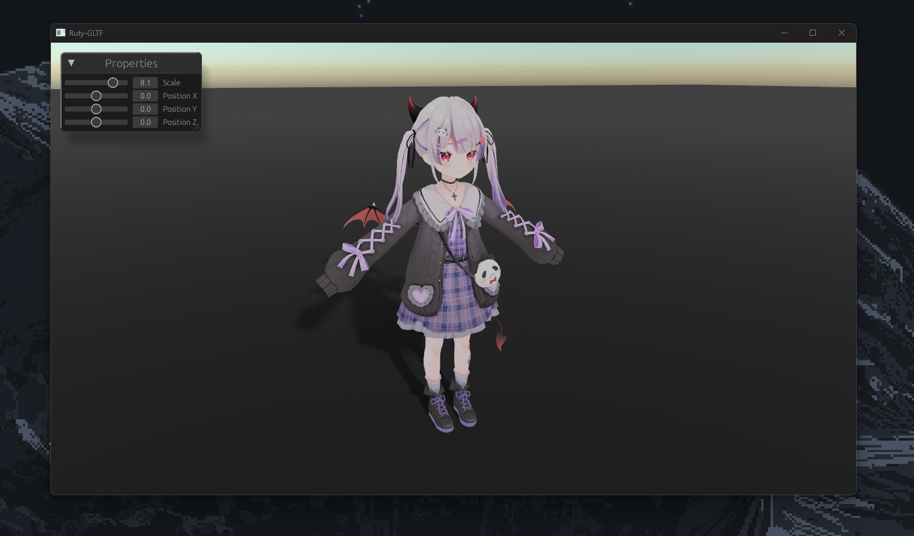

# 3D Model Viewer using Rust and Bevy
Rewritting My Old Gltf 3d Model Viewer In Rust Using Bevy .It used 
bevy_blendy_camera for viewport interaction "Pan Zoom tilt"
Enter Key Triggers the file Manager where gltf files can be loaded

</img>
<ul>
  <li><strong>bevy</strong> - A refreshingly simple data-driven game engine built in Rust.<a href="https://bevyengine.org/" target="_blank"> Bevy </a></li>
</ul>
